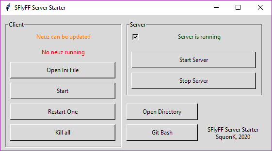

# ServerStarter

This is a small python script intended to FlyFF developpers to make it easier to start / restart the parts of the server during development.



## Install the script

This script uses python, so be sure python is installed on your system. As FlyFF is entirely running on Windows, the script is made to be compatible with Windows only.

- The script was developped on Python 3.6. Compatibility with other python version has not been tested.

- You also need tkinter for the graphic UI `python -m pip install tkinter`

- The script can be started by running the provided bat file or `python LauncherWindow.py`

- This repo should be cloned in a repertory next to the Source, Program and Resource folders.

    - For example, if your FlyFF development folder is `B:\FlyFF\`, your output folder should be `B:\FlyFF\Output`, your resource folder should be `B:\FlyFF\Resource`, and the files of this repository will be for example in `B:\FlyFF\Starter`.
    - More precisely, the Output folder has to be relatively to the script `..\Output`, the Program folder has to be `..\Program` and the Resource folder has to be `..\Resource`
    - If your folders are named differently, search for occurences of theses folders to replace them with the one corresponding to your project in `Launcher.py`

## Goal

This script is able to start the differents programs managing a server and start Neuz instances. The goal is to provide a centralized entry point to test a server locally.

- The script tracks for new Server Executable and can run them

    - This script uses the files found in `..\Output\X\Release\X.exe` as the "newly compiled files". When the user starts a server, it will check if new compiled files are more up to date than the one in `Program`, and if so, it will replace the one in the Program folder with the one in the Output folder.

    - The server is started using the executables in `..\Program.exe`.

    - The script tracks every second if new compiled files are available, and displays it. When pressing Start, if the server is running and some parts are either off or obsoleted by a new compilation, the script will shutdown the needed parts, update the executables, and restart the server.

    - Windows can be hidden to lighten the taskbar by checking the checkbox before starting the server.

- A similar machinery is applied to Neuz : 

    - Original Neuz is found in `..\Output\Neuz\NoGameguard\Neuz.exe` for update purpose.
    
    - The script enables to run `..\Resource\Neuz.exe`and edit its corresponding ini file with a simple button
    
    - If the user starts Neuz, and no Neuz is running, it will copy the eventual new compiled executable from Output to Resource.

- For any other manipulation, a button which opens the parent repertory of the script is available.


## Code organization

- Every Launcher file is generated by PAGE except Launcher.py which contains every class and function to manage the processes.

- The code organization is basically a parody of MVC.

- `Program` and `FlyFFLauncher` classes are the model classes which are responsible for managing executable / process. The function `link_with_gui` makes every binding between the UI and the model.

## Misc.

- This script is only intended for development purpose, and should not be used in production. The main reason you shouldn't use this in production context is that the main goal of the application, tracking for newly compiled executables and replacing started processes, is useless in this case.

- For production context, if one wants to have a simple script to runs every part of the server without the layer of executable tracking and without the hassle of starting manually 7 processes, here is a simple bat script :

```bash
start "" AccountServer.exe
timeout 2
start "" DatabaseServer.exe
timeout 2
start "" CoreServer.exe
timeout 2
start "" Certifier.exe
timeout 2
start "" LoginServer.exe
timeout 2
start "" CacheServer.exe
timeout 2
start "" WorldServer.exe
```

- This script is distributed under the MIT Licence.
